# Задание № 1
___
## 📌 Работаем в командной строке (терминале ОС)
___
## 📌 Создайте каталог для проекта first_project и разверните виртуальное окружение Python в папке venv внутри каталога

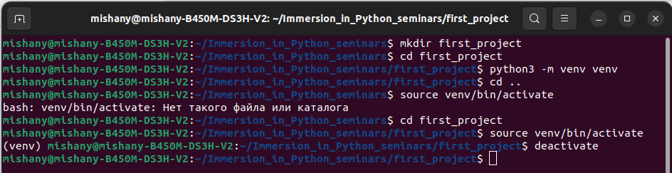
___
## 📌 Создайте каталог для проекта second_project и разверните виртуальное окружение Python в папке virtual внутри каталога

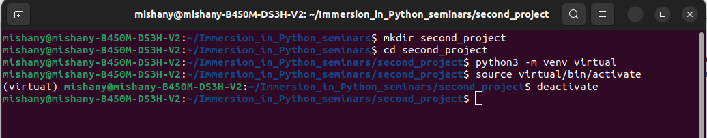
___
## 📌 Создайте третий каталог проекта project_new и разверните виртуальное окружение Python в папке venv_new внутри каталога

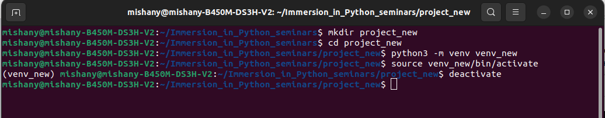
___
## 📌 Для каждого проекта последовательно активируйте и деактивируйте виртуальное окружение
___
___

# Задание № 2
___
## 📌 Активируем виртуальное окружение первого из трёх созданных проектов и устанавливаем в него модуль requests используя pip
___
## 📌 Проверяем установку выводом списка модулей в консоль
___
## 📌 Сохраняем список в файл, проверяем результат и выходим из окружения

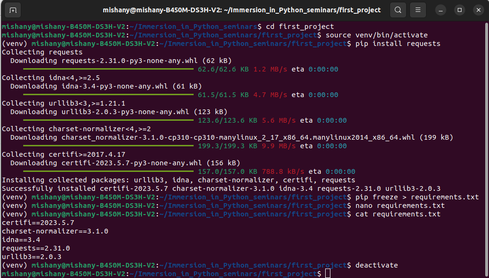
___

## 📌 Активируем виртуальное окружение второго из трёх созданных проектов и устанавливаем в него модуль flask используя pip
___

## 📌 Проверяем установку выводом списка модулей в консоль
___

## 📌 Сохраняем список в файл и выходим из окружения

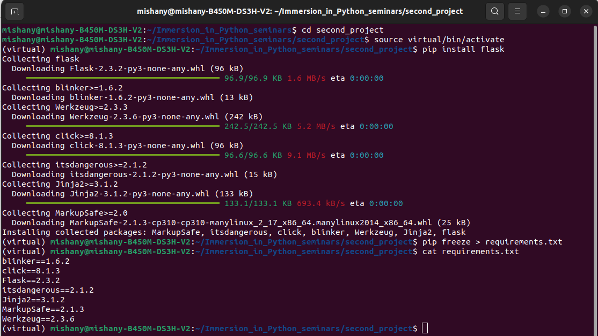
___

## 📌 Активируем третье виртуальное окружение
___

## 📌 Устанавливаем в него модули из первого и второго проекта используя ранее сохранённые в файлы списки модулей

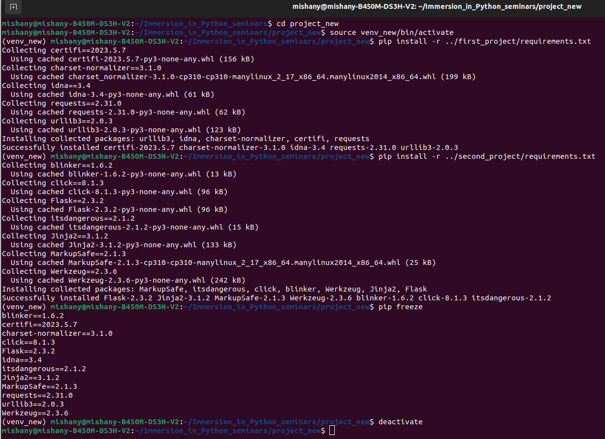
___

## 📌 Проверяем установку выводом списка модулей в консоль
___
___

# Задание № 3
___
## 📌 Работа в консоли в режиме интерпретатора Python.
___
## 📌 Решите квадратное уравнение 5x 2-10x-400=0 последовательно сохраняя переменные a, b, c, d, x1 и x2.

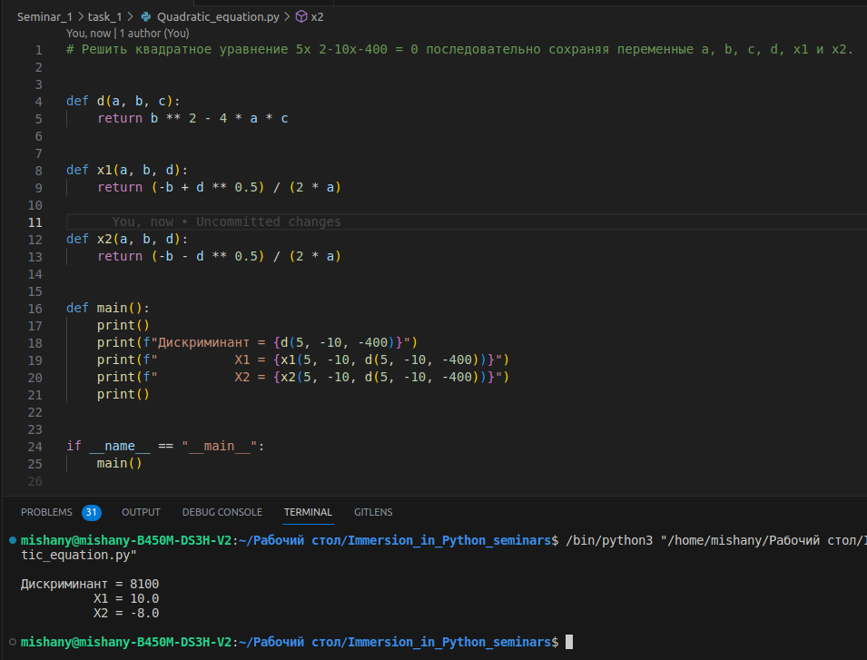
___
## 📌 *Попробуйте решить уравнения с другими значениями a, b, c.

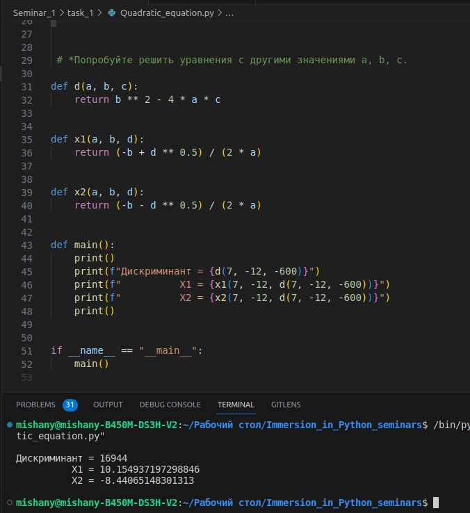
___
___

# Задание № 4
___
## 📌 Работа в консоли в режиме интерпретатора Python.
___
## 📌 Посчитайте сумму чётных элементов от 1 до n исключая кратные e.
___
## 📌 Используйте while и if.

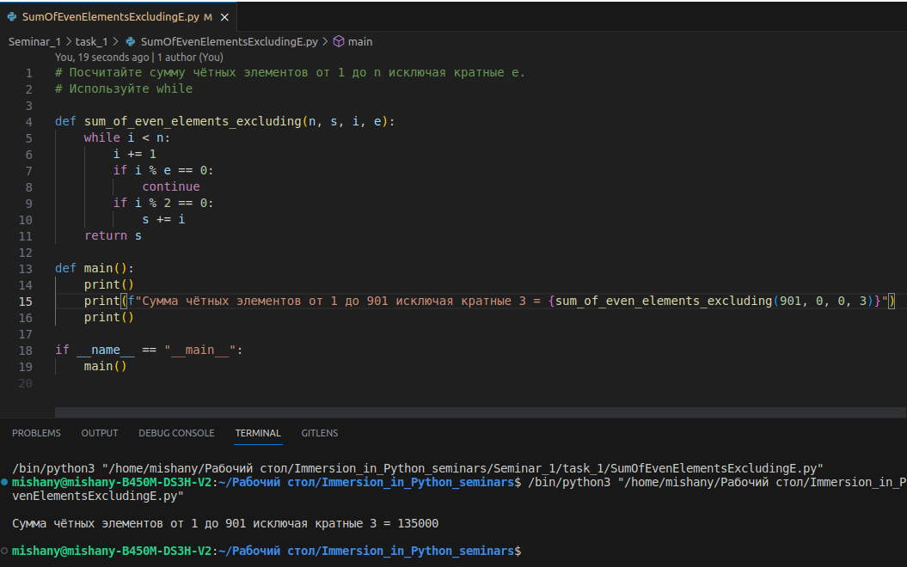

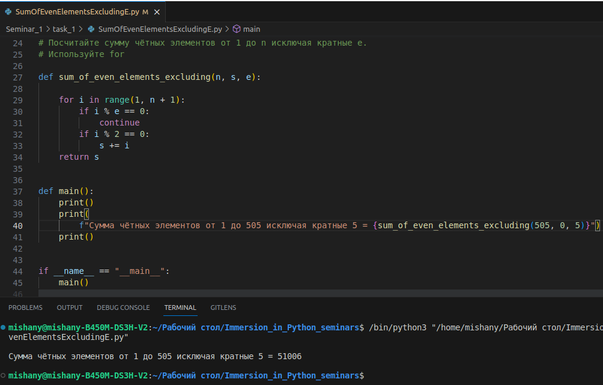
___
## 📌 Попробуйте разные значения e и n.
___
___

# Задание № 5
___

## 📌 Напишите программу, которая запрашивает год и проверяет его на високосность.
___

## 📌 Распишите все возможные проверки в цепочке elif
___

## 📌 Откажитесь от магических чисел
___

## 📌 Обязательно учтите год ввода Григорианского календаря
___

## 📌 В коде должны быть один input и один print

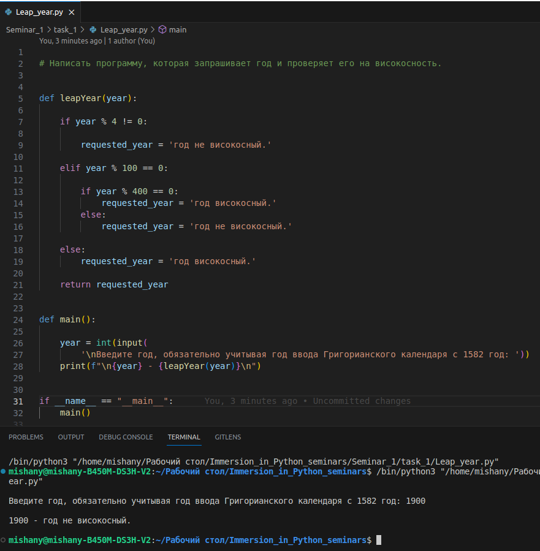
___
___

# Задание № 6
___
## 📌 Пользователь вводит число от 1 до 999. Используя операции с числами сообщите что введено: цифра, двузначное число или трёхзначное число.
___
## 📌 Для цифры верните её квадрат, например 5 - 25
___
## 📌 Для двузначного числа произведение цифр, например 30 - 0
___
## 📌 Для трёхзначного числа его зеркальное отображение, например 520 - 25
___
## 📌 Если число не из диапазона, запросите новое число
___
## 📌 Откажитесь от магических чисел
___
## 📌 В коде должны быть один input и один print

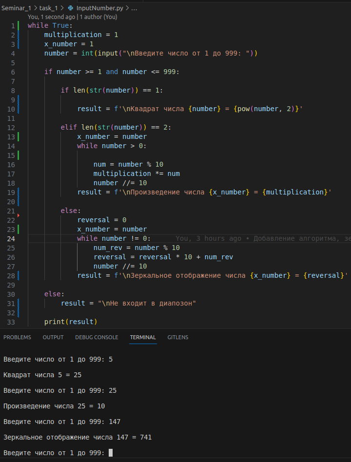
___
___

# Задание № 7 
___
## 📌 Нарисовать в консоли ёлку спросив у пользователя количество рядов.
___
## 📌 Пример результата: Сколько рядов у ёлки? 5

### -----*-----
### ----***----
### ---*****---
### --*******--
### -*********-

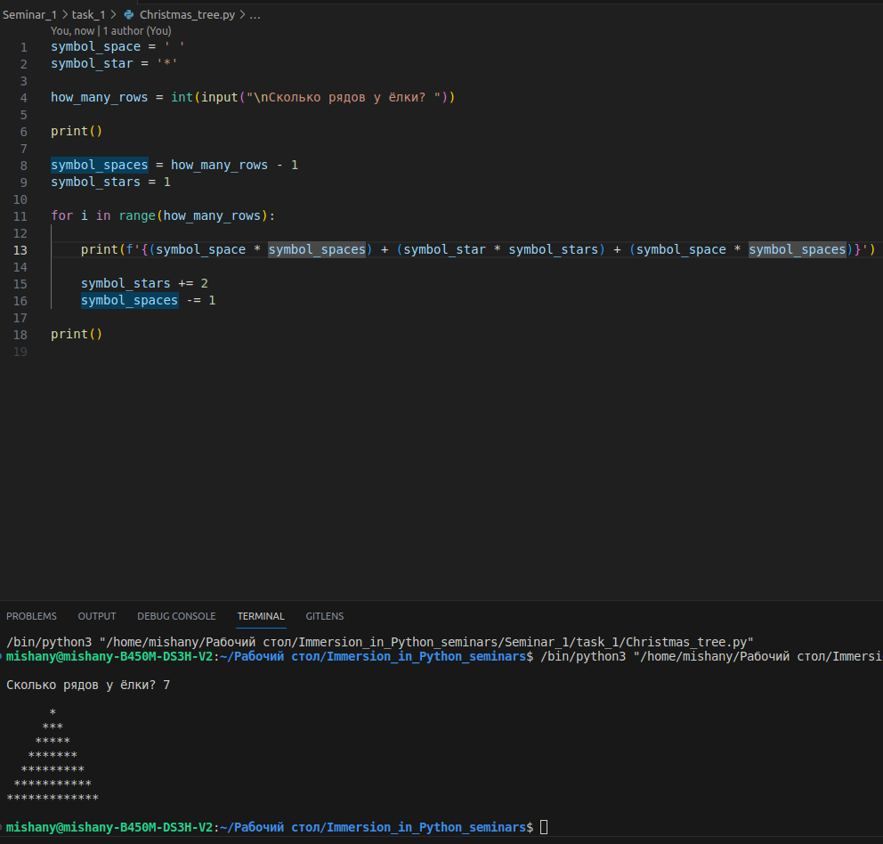
___
___

# Задание № 8
___
## 📌 Выведите в консоль таблицу умножения от 2х2 до 9х10 как на школьной тетрадке.

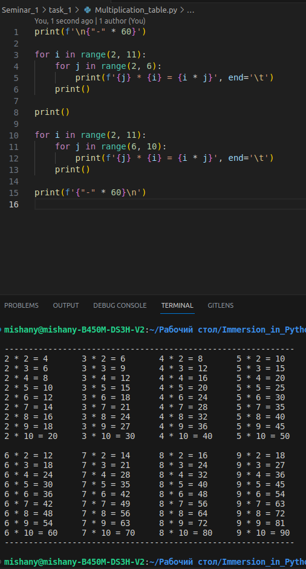
___
___
