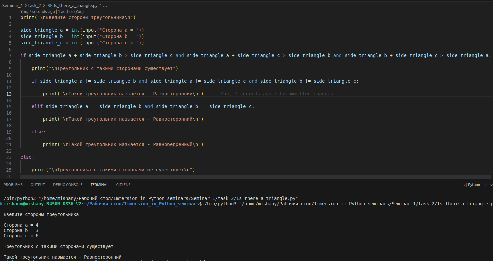

# Задание № 2
___

## ✔ Треугольник существует только тогда, когда сумма любых двух его сторон больше третьей. Дано a, b, c — стороны предполагаемого треугольника. Требуется сравнить длину каждого отрезка-стороны с суммой двух других. Если хотя бы в одном случае отрезок окажется больше суммы двух других, то треугольника с такими сторонами не существует. Отдельно сообщить является ли треугольник разносторонним, равнобедренным или равносторонним.

___
___