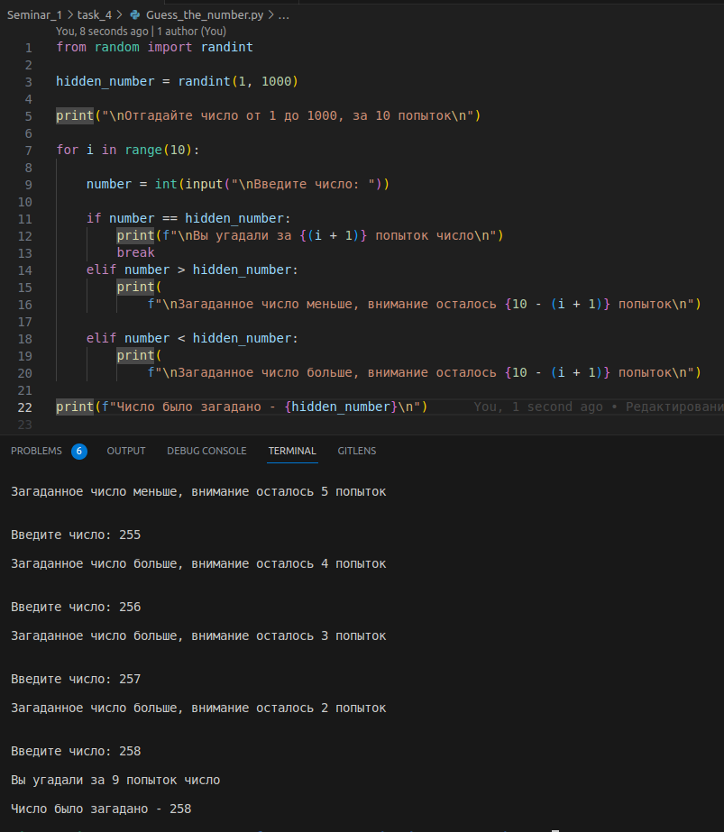

# Задание № 4
___
## ✔ Программа загадывает число от 0 до 1000. Необходимо угадать число за 10 попыток. Программа должна подсказывать «больше» или «меньше» после каждой попытки. Для генерации случайного числа используйте код:
___
***from random import randint***

***num = randint(LOWER_LIMIT, UPPER_LIMIT)*** 

___
___