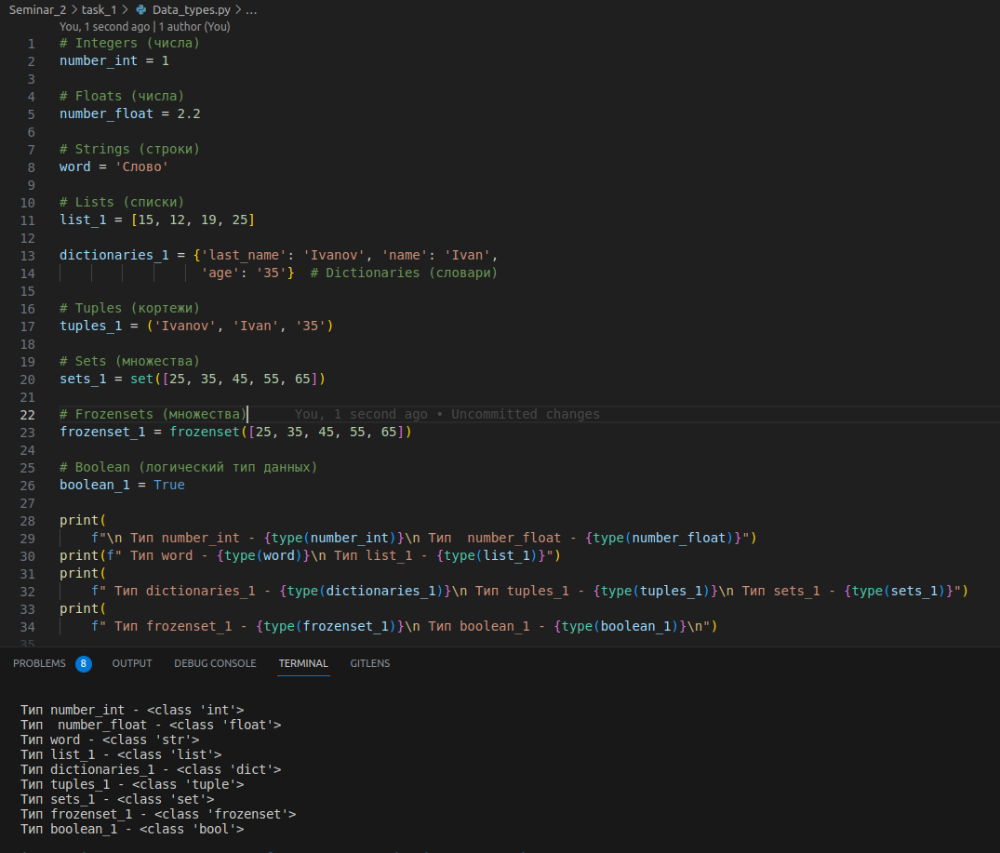
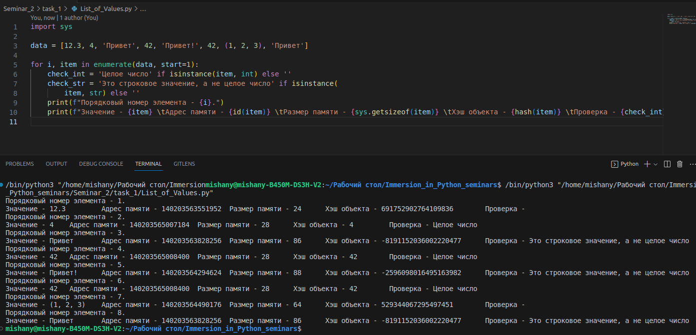
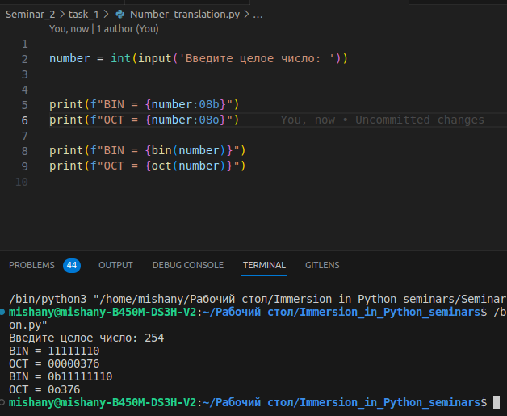
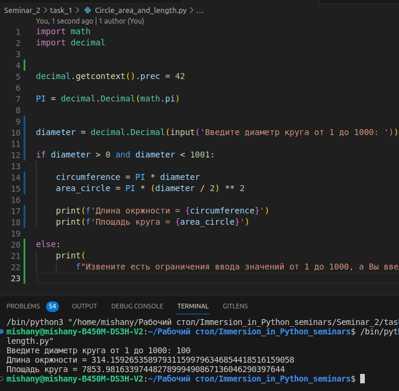
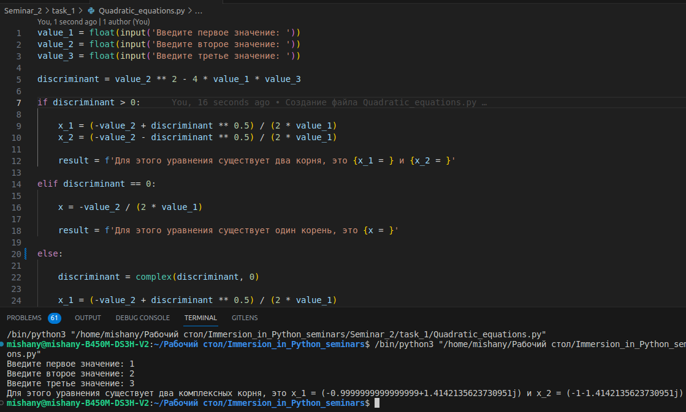
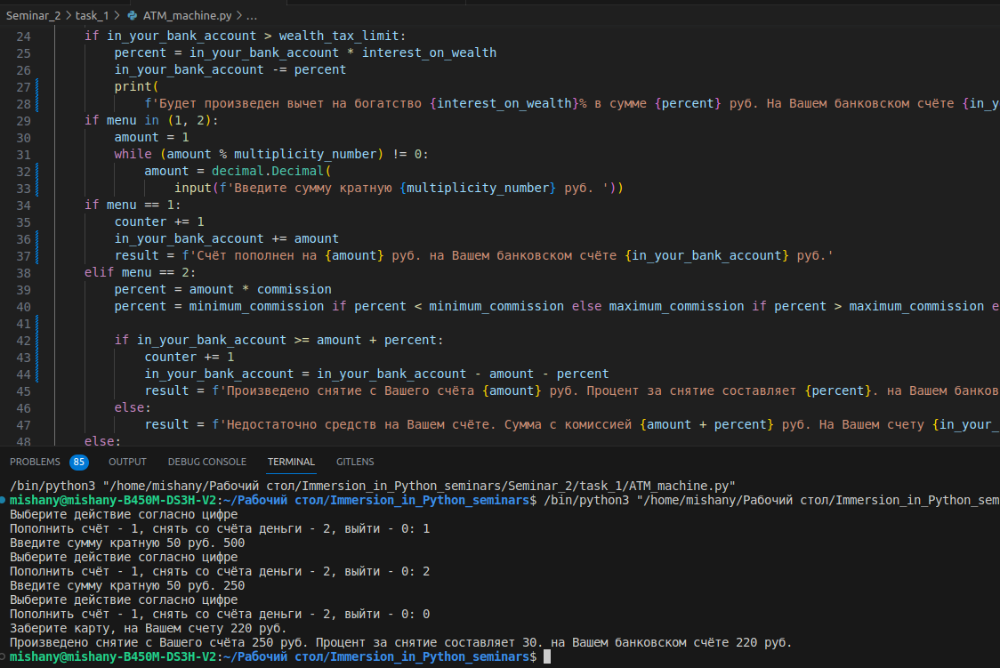

# Задание №1
___
## 1. Создайте несколько переменных разных типов.
___
## 2. Проверьте к какому типу относятся созданные переменные.

___
___

# Задание №2
___

## Создайте в переменной data список значений разных типов перечислив их через запятую внутри квадратных скобок. Для каждого элемента в цикле выведите:
___
### ✔ порядковый номер начиная с единицы
___
### ✔ значение
___
### ✔ адрес в памяти
___
### ✔ размер в памяти
___
### ✔ хэш объекта
___
### ✔ результат проверки на целое число только если он положительный
___
### ✔ результат проверки на строку только если он положительный
___
### Добавьте в список повторяющиеся элементы и сравните на результаты.

___
___

# Задание № 3
___
## ✔ Напишите программу, которая получает целое число и возвращает его двоичное, восьмеричное строковое представление.
___
## ✔ Функции bin и oct используйте для проверки своего результата, а не для решения.
___
## Дополнительно:
___
### ✔ Попробуйте избежать дублирования кода в преобразованиях к разным системам счисления
___
### ✔ Избегайте магических чисел
___
### ✔ Добавьте аннотацию типов где это возможно

___
___

# Задание № 4
___
## ✔ Напишите программу, которая вычисляет площадь круга и длину окружности по введённому диаметру.
___
## ✔ Диаметр не превышает 1000 у.е.
___
## ✔ Точность вычислений должна составлять не менее 42 знаков после запятой.

___
___

# Задание № 5
___
## ✔ Напишите программу, которая решает квадратные уравнения даже если дискриминант отрицательный.
___
## ✔ Используйте комплексные числа для извлечения квадратного корня.

___
___

# Задание № 6
___
## Напишите программу банкомат.
___
### ✔ Начальная сумма равна нулю
___
### ✔ Допустимые действия: пополнить, снять, выйти
___
### ✔ Сумма пополнения и снятия кратны 50 у.е.
___
### ✔ Процент за снятие — 1.5% от суммы снятия, но не менее 30 и не более 600 у.е.
___
### ✔ После каждой третей операции пополнения или снятия начисляются проценты - 3%
___
### ✔ Нельзя снять больше, чем на счёте
___
### ✔ При превышении суммы в 5 млн, вычитать налог на богатство 10% перед каждой
## операцией, даже ошибочной
___
### ✔ Любое действие выводит сумму денег

___
___