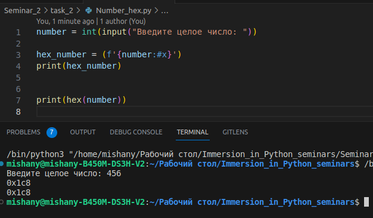

# Задание № 1
___
## ✔ Решить задачи, которые не успели решить на семинаре.
___
## ✔ Напишите программу, которая получает целое число и возвращает его шестнадцатеричное строковое представление. Функцию hex используйте для проверки своего результата.

___
___