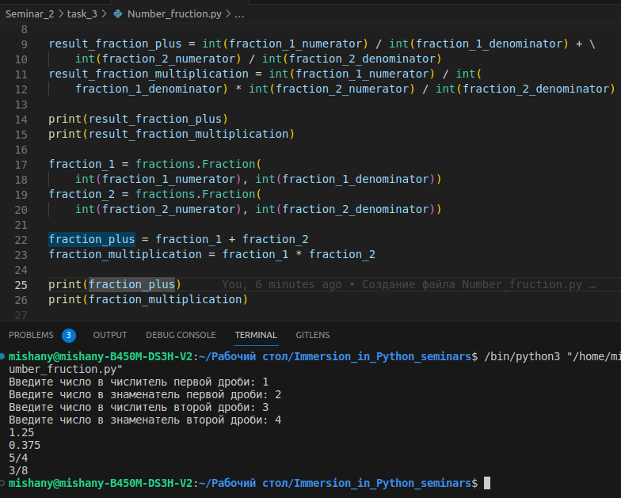

# Задание № 1
___
## ✔ Напишите программу, которая принимает две строки вида “a/b” — дробь с числителем и знаменателем.Программа должна возвращать сумму и *произведение дробей. Для проверки своего кода используйте модуль fractions.

___
___
